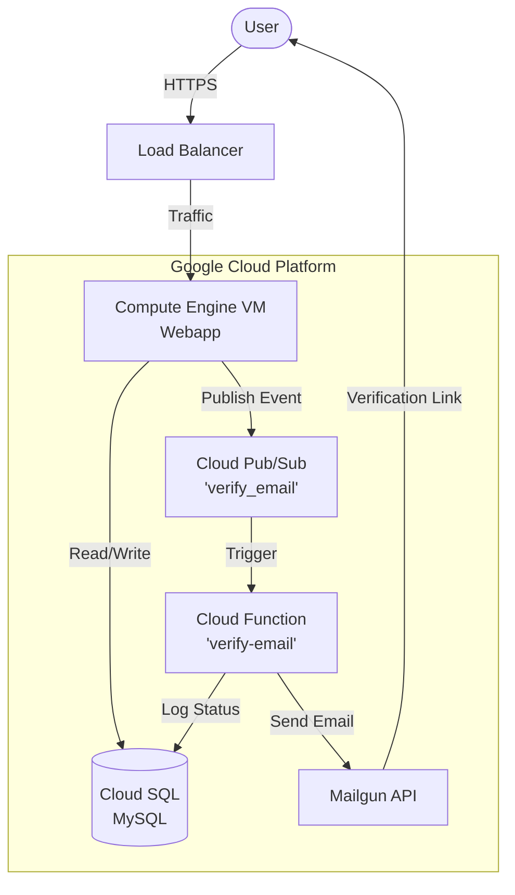

# Cloud-Native Web Application with Infrastructure Automation

<div align="center">

[](https://nodejs.org/)
[](https://www.typescriptlang.org/)
[](https://cloud.google.com/)
[](https://www.terraform.io/)
[](https://www.packer.io/)
[](https://www.prisma.io/)
[](https://www.mysql.com/)

</div>

---

## Abstract

This project demonstrates a scalable, automated cloud infrastructure built on Google Cloud Platform (GCP). It leverages cloud-native concepts to deploy a RESTful API with automated infrastructure provisioning using Terraform and custom machine images built with Packer. The architecture prioritizes reliability, security, and automation, incorporating event-driven processing, managed database services, and continuous integration pipelines.

## Table of Contents

-   [Architecture and Design](#architecture-and-design)
-   [Web Application](#web-application)
-   [Infrastructure as Code](#infrastructure-as-code)
-   [Google Cloud Platform Networking](#google-cloud-platform-networking)
-   [Custom Machine Image](#custom-machine-image)
-   [Database Configuration](#database-configuration)
-   [Monitoring and Logging](#monitoring-and-logging)
-   [Event-Driven Architecture](#event-driven-architecture)
-   [Load Balancing and Autoscaling](#load-balancing-and-autoscaling)
-   [Security and Encryption](#security-and-encryption)
-   [Continuous Deployment](#continuous-deployment)
-   [Getting Started / Usage](#getting-started--usage)

## Architecture and Design

The project adopts a cloud-native architecture, emphasizing modularity and scalability.



Key components include:
*   **Microservices**: Decoupled components for user management (Webapp) and background processing (Cloud Function).
*   **RESTful API**: Built with Node.js, TypeScript, and Prisma, ensuring robust and strictly typed endpoints.
*   **Infrastructure as Code (IaC)**: Entirely managed using Terraform for consistent and repeatable deployments.

## Web Application

A cloud-native RESTful API designed for user management and health checks, implemented with:

*   **Node.js & TypeScript**: Ensuring type safety and modern JavaScript features.
*   **Prisma ORM**: Efficiently interacting with the MySQL database.
*   **Basic Authentication**: Securely accessing endpoints using hashed passwords (Bcrypt) and tokens (JWT).
*   **Integration Tests**: Comprehensive testing suite (Jest/Supertest) ensuring endpoint functionality.

## Infrastructure as Code

Terraform scripts automate the provisioning of GCP resources:

*   **VPC and Subnets**: Custom Virtual Private Cloud for network isolation.
*   **Cloud SQL**: Private MySQL instance for secure data storage.
*   **IAM Roles**: Least-privilege access management for Service Accounts and Cloud Functions.
*   **Compute Engine**: Managed Instance Groups for the application layer.

## Google Cloud Platform Networking

The network setup includes:

*   **VPC**: A dedicated VPC prevents access from the default network.
*   **Firewall Rules**: Strictly defined rules allowing only necessary traffic (e.g., Load Balancer to Webapp on application ports).
*   **Private Service Access**: Private connection between the VPC and Cloud SQL instance.

## Custom Machine Image

Custom CentOS Stream 8 image created using HashiCorp Packer:

*   **Pre-installed Dependencies**: Node.js, Ops Agent, and application artifacts are baked into the image.
*   **Systemd Service**: Configures the Webapp to start automatically on boot.
*   **Reproducibility**: Packer templates ensure every deployed instance is identical.

## Database Configuration

Configured with Terraform and Prisma:

*   **Cloud SQL**: High-availability MySQL instance.
*   **Private IP**: The database is accessible only within the VPC, enhancing security.
*   **Dynamic Configuration**: Startup scripts fetch metadata to generate the `.env` file with database credentials dynamically.

## Monitoring and Logging

Ensures application health and performance:

*   **Google Cloud Ops Agent**: Installed on VMs to collect system metrics and application logs.
*   **Winston Logger**: Structured logging within the Node.js application for easier analysis in Cloud Logging.

## Event-Driven Architecture

Utilizes Google Cloud Pub/Sub and Cloud Functions for asynchronous processing:

*   **Publisher**: The Webapp publishes a message to the `verify_email` topic upon new user registration.
*   **Subscriber**: A Serverless Cloud Function triggers on the message to send a verification email via Mailgun.

## Load Balancing and Autoscaling

Handles traffic efficiently and scales based on demand:

*   **Instance Template**: Defines the VM configuration based on the custom Packer image.
*   **Managed Instance Group (MIG)**: Automatically scales the number of instances based on CPU utilization.
*   **Global Load Balancer**: Distributes incoming HTTP(S) traffic across available instances in the MIG.
*   **SSL Certificates**: Managed Google-managed SSL certificates for secure HTTPS communication.

## Security and Encryption

Enhances data protection:

*   **SSL/TLS**: All external communication is secured via HTTPS.
*   **Private Network**: Database and internal components are isolated from the public internet.
*   **Secrets Management**: Sensitive data like database passwords are managed via Terraform state and Instance Metadata, not hardcoded.

## Continuous Deployment

Automates updates and integration:

*   **GitHub Actions**: Pipelines for running tests, checking headers, and building Packer images.
*   **Integration Testing**: Automated tests run on every pull request to ensure code quality.

## Getting Started / Usage

### Prerequisites

Ensure you have the following tools installed:

*   **Node.js** (v20.x) & **npm**
*   **Terraform** (v1.5+)
*   **Packer** (v1.9+)
*   **Google Cloud SDK** (`gcloud`) configured with your project.

### 💻 Local Development (Webapp)

To run the application locally for development and testing:

1.  **Clone the Repository**
    ```bash
    git clone <repository-url>
    cd InfraAutomation/Webapp
    ```

2.  **Install Dependencies**
    ```bash
    npm install
    ```

3.  **Configure Environment Variables**
    Create a `.env` file in the `Webapp` root directory. You can use the following template:

    ```env
    # Database Configuration
    DB_HOST=localhost
    DB_USER=root
    DB_PASSWORD=your_local_db_password
    DATABASE_URL="mysql://${DB_USER}:${DB_PASSWORD}@${DB_HOST}:3306/webapp"

    # Pub/Sub Configuration (Optional for local dev unless using emulator)
    TOPIC_NAME=verify_email
    ```

4.  **Database Migration**
    Ensure you have a local MySQL instance running. Run the following to setup the schema:
    ```bash
    npx prisma migrate dev --name init
    ```

5.  **Start the Application**
    ```bash
    # Development mode (restarts on file changes)
    npm run dev

    # Production build
    npm run build
    npm start
    ```

### ☁️ Infrastructure Deployment

This project uses **Packer** to build machine images and **Terraform** to provision infrastructure.

#### 1. Build Custom Machine Image (Packer)

This step creates a Compute Engine image with the application and dependencies pre-installed.

```bash
cd InfraAutomation/Webapp/packer

# Initialize Packer plugins
packer init .

# Build the image
# Replace 'your-project-id' with your actual GCP Project ID
packer build \
  -var 'project_id=your-project-id' \
  -var 'source_image_family=centos-stream-8' \
  .
```

#### 2. Provision Infrastructure (Terraform)

Deploy the network, database, and compute resources.

1.  **Navigate to Terraform Directory**
    ```bash
    cd ../../Terraform
    ```

2.  **Initialize Terraform**
    ```bash
    terraform init
    ```

3.  **Create Variables File**
    Create a `terraform.tfvars` file to define your environment configurations. **Do not commit this file.**

    ```hcl
    project_id      = "your-project-id"
    region          = "us-east1"
    zone            = "us-east1-b"
    vpc_name        = "my-vpc"
    
    # Database
    db_password     = "secure-password-here"
    
    # Mailgun (for email verification)
    mailgun_api_key = "your-mailgun-api-key"
    mailgun_url     = "https://api.mailgun.net/v3/your-domain.com/messages"
    
    # DNS
    dns_record_name       = "my-app."
    dns_managed_zone_name = "my-zone"
    ```

4.  **Plan and Apply**
    ```bash
    # Review changes
    terraform plan -var-file="terraform.tfvars"

    # Deploy resources
    terraform apply -var-file="terraform.tfvars"
    ```

## License

This project is licensed under the ISC License.

